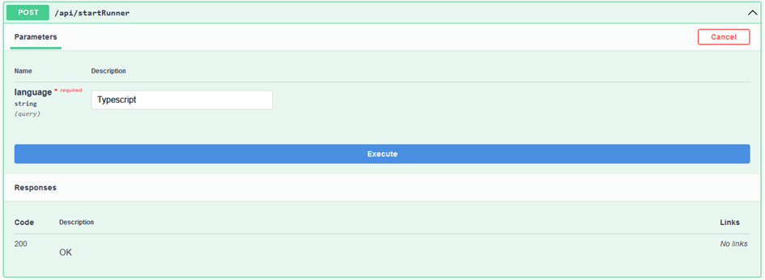
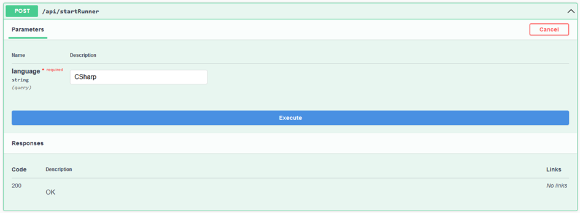
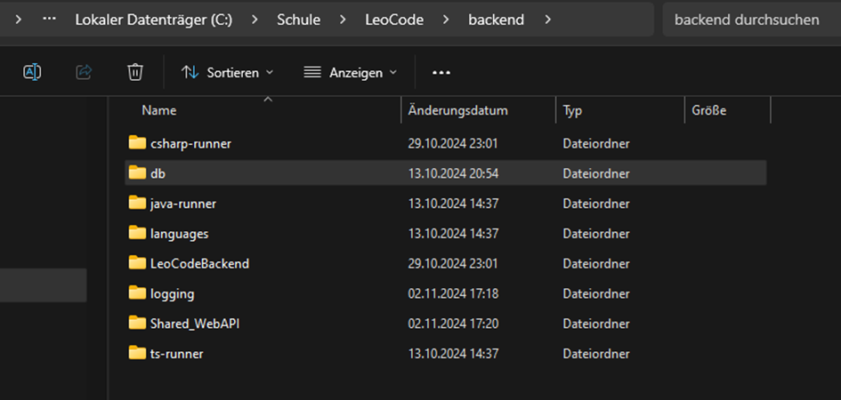
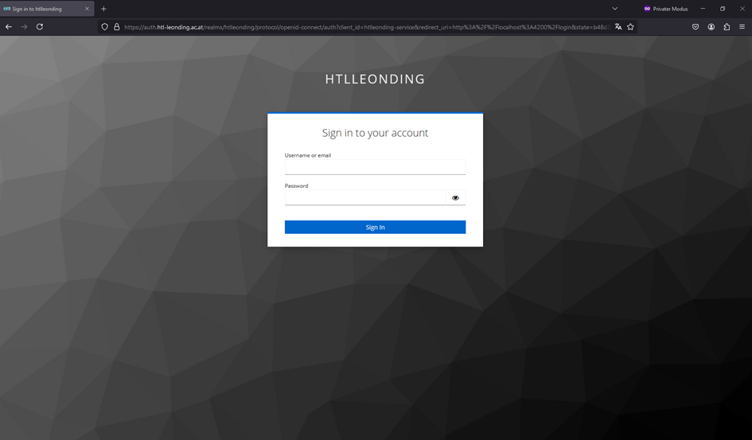

# 🚀 LeoCode – Projektstart-Dokumentation

Diese Anleitung führt dich Schritt für Schritt durch die notwendigen Schritte, um das LeoCode-Projekt lokal zu starten – vom Setup des Backends und Frontends bis hin zum Erstellen der benötigten Docker-Images für die Runner.

## 🧑‍💻 Projektstart

Öffne das Projektverzeichnis in Visual Studio Code, um effizient mit dem Code arbeiten zu können.
### 🔧 Schritt 1: Backend-Templates vorbereiten

Damit der `TypeScript-Code` später korrekt ausgeführt werden kann, müssen zunächst die Abhängigkeiten in den Templates installiert werden.

    Navigiere im Terminal in folgendes Verzeichnis:

    LeoCode/backend/languages/Typescript/templates

Öffne innerhalb dieses Ordners einen beliebigen Template-Unterordner. Hier befinden sich verschiedene Beispiel- oder Projekt-Templates für den TypeScript-Runner.

Führe nun folgenden Befehl im Terminal aus, um alle benötigten `Node-Abhängigkeiten` im darüberliegenden Verzeichnis zu installieren:

    npm install --prefix ../../

    💡 Dieser Befehl installiert die Pakete im languages/Typescript-Verzeichnis, auf das die Templates zugreifen.

### 🌐 Schritt 2: Frontend vorbereiten

Damit du die Benutzeroberfläche des Projekts im Browser sehen und testen kannst, muss auch das Frontend eingerichtet und gestartet werden.

    Navigiere ins Frontend-Verzeichnis:

    LeoCode/frontend

Installiere die benötigten Node-Module (Abhängigkeiten), die für Angular benötigt werden:

    npm install

Starte anschließend das `Angular-Frontend` mit dem folgenden Befehl:

    npx ng serve

    🔍 Nach erfolgreichem Start kannst du die Webanwendung unter http://localhost:4200 im Browser aufrufen.

### 🐳 Schritt 3: Docker-Images für die Runner bauen

Damit die Backend-Komponenten (die sogenannten "Runner", welche Code ausführen) funktionieren, müssen passende `Docker-Images` gebaut werden. Es gibt einen `Runner` für TypeScript und einen für C#.

▶️ `TypeScript Runner`

    Navigiere in den Ordner für den TypeScript-Runner:

    LeoCode/backend/ts-runner

Erstelle das Docker-Image mit folgendem Befehl:

    docker build -t ts-runner .

    📦 Das Image erhält den Namen ts-runner und kann später für Container-basierte Ausführung verwendet werden.

▶️ `C# Runner`

    Navigiere in den Ordner für den C#-Runner:

    LeoCode/backend/csharp-runner

Baue das Docker-Image mit:

    docker build -t csharp-runner .

⚙️ Dieses `Image` wird für das Ausführen von `C#-Code` in einer isolierten Umgebung benötigt.

### Schritt 4: LeoCodeBacken Starten
Als nächstes muss das `LeoCodeBackend` im Visual Studio gestartet werden um die `Runner` zu starten.

▶️ TypeScript Runner

▶️ C# Runner

### 🗄️ Schritt 5: Datenbank starten

Öffne als Nächstes das Projekt **`db`** in **Visual Studio**.

1. Führe zunächst den **Datenimport** aus (z. B. über den Importer im `ImportController`).
2. Anschließend kannst du die **API des Datenbank-Projekts** starten.

### Schritt 6: Login über KeyClock
Rufe anschließend im Browser die Adresse **http://localhost:4200** auf und melde dich mit deiner `IF-Nummer` sowie deinem `Passwort` an.

## Abschluss und Hinweise

Wenn alle Schritte erfolgreich abgeschlossen wurden, solltest du nun:

- Zugriff auf die Weboberfläche unter `http://localhost:4200` haben  
- Dich mit deinen Zugangsdaten einloggen können  
- Die wichtigsten Dienste wie **Frontend**, **Backend**, **Runner-Container** und **Datenbank** lokal laufen sehen

Falls nach dem Login keine Inhalte wie z. B. **Assignments** angezeigt werden, stelle sicher, dass dein Benutzer korrekt im System angelegt wurde.  
Du kannst Beispielnutzer in der Datei `ImportController.cs` im `db`-Projekt anpassen oder erweitern.

> Für die Anzeige der Lehreransicht:  
> Weise deinem Benutzer Lehrerrechte zu, indem du eine zusätzliche IF-Nummer mit entsprechender Rolle im Demo-Import definierst.

